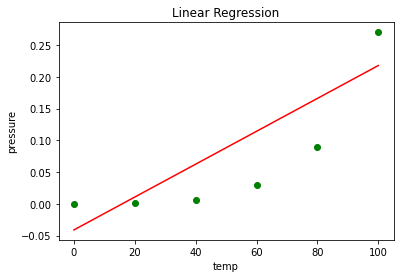
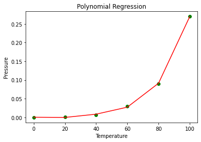

```python
import numpy as np
import matplotlib.pyplot as plt
import pandas as pd
```


```python
data=pd.read_csv("data.csv")
data.head()
```


<div>
<style scoped>
    .dataframe tbody tr th:only-of-type {
        vertical-align: middle;
    }

    .dataframe tbody tr th {
        vertical-align: top;
    }

    .dataframe thead th {
        text-align: right;
    }
</style>
<table border="1" class="dataframe">
  <thead>
    <tr style="text-align: right;">
      <th></th>
      <th>sno</th>
      <th>Temperature</th>
      <th>Pressure</th>
    </tr>
  </thead>
  <tbody>
    <tr>
      <th>0</th>
      <td>1</td>
      <td>0</td>
      <td>0.0002</td>
    </tr>
    <tr>
      <th>1</th>
      <td>2</td>
      <td>20</td>
      <td>0.0012</td>
    </tr>
    <tr>
      <th>2</th>
      <td>3</td>
      <td>40</td>
      <td>0.0060</td>
    </tr>
    <tr>
      <th>3</th>
      <td>4</td>
      <td>60</td>
      <td>0.0300</td>
    </tr>
    <tr>
      <th>4</th>
      <td>5</td>
      <td>80</td>
      <td>0.0900</td>
    </tr>
  </tbody>
</table>
</div>


```python
X=data.iloc[:,1:2]
```


```python
X.columns
```


    Index(['Temperature'], dtype='object')


```python
y=data.iloc[:,2:]
```


```python
y.columns
```


    Index(['Pressure'], dtype='object')


```python
from sklearn.model_selection import train_test_split
```


```python
X_train,X_test,y_train,y_test=train_test_split(X,y,test_size=0.3)
```


```python
print("xtrain shape: ",X_train.shape)
```

    xtrain shape:  (4, 1)
    


```python
print("ytrain shape: ",y_train.shape )
```

    ytrain shape:  (4, 1)
    


```python
from sklearn.linear_model import LinearRegression
```


```python
reg=LinearRegression()
```


```python
reg.fit(X_train,y_train)
```


    LinearRegression()


```python
y_pred=reg.predict(X)
```


```python
plt.scatter(X,y,c="green")
plt.plot(X,y_pred,color="red")
plt.xlabel("temp")
plt.ylabel("pressure")
plt.title("Linear Regression")
plt.show()
```





```python
#plynomial regression
```


```python
from sklearn.preprocessing import PolynomialFeatures
```


```python
poly=PolynomialFeatures(degree=4)
X_poly=poly.fit_transform(X)
```


```python
poly.fit(X_poly,y)
lin2=LinearRegression()
lin2.fit(X_poly,y)

```


    LinearRegression()


```python
plt.scatter(X,y,color="green")
plt.plot(X,lin2.predict(poly.fit_transform(X)),color='red')
plt.title('Polynomial Regression') 
plt.xlabel('Temperature') 
plt.ylabel('Pressure') 
  
plt.show() 

```





```python

```
